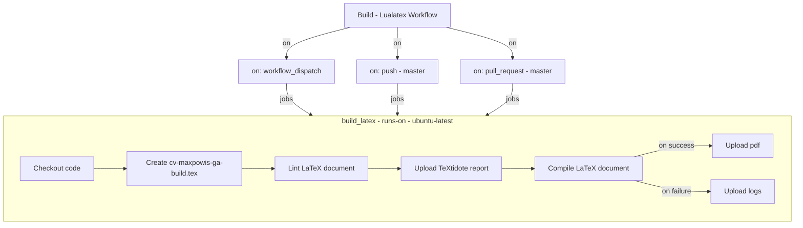

<a name="readme-top"></a>


<!-- PROJECT LOGO -->
<br />
<div align="center">
  <a href="https://github.com/maxpowis/cv">
    
  </a>

  <h3 align="center">Max Powis's CV on 💊 steroids</h3>

  <p align="center">
    My latex 🧔‍♂️ CV built, thumbnailed, released and published to <br/> my GitHub Pages personal website through GitHub actions 🤘
    <br />
    <a href="https://max.pow.is/cv"><strong>View online »</strong></a>
    <br />
    <br />
    <a href="https://github.com/maxpowis/cv/discussions">Share ideas</a>
    ·
    <a href="https://github.com/maxpowis/cv/issues">Report Bug</a>
    ·
    <a href="https://github.com/maxpowis/cv/issues">Request Feature</a>
  </p>
</div>

<!-- TABLE OF CONTENTS -->
# Table of Contents

* [About The Project](#about-the-project)
* [Built With](#built-with)
* [Getting Started](#getting-started)
    * [Prerequisites](#prerequisites)
    * [Preparatory steps](#preparatory-steps)
* [Usage](#usage)
    * [Using Local Environment](#using-local-environment)
    * [Using GitHub Actions](#using-github-actions)
        * [Continuous build](#continuous-build)
* [Roadmap](#roadmap)
* [License](#license)
* [Contact](#contact)

<!-- ABOUT THE PROJECT -->
# About The Project

The source code was forked and adapted from [Professional CV](https://github.com/hmemcpy/cv) by Igal Tabachnik.

Peronal add-ons:

* compute age
* helpers for employer & job records with computed experience durations
* can be dyanamically generated in light or dark mode version
* embed version number as clickable link (to corresponding release page)
* GitHub actions
  * build & release  light & dark versions with version numbering embedded in the generated pdf
  * publish latest release to my GitHub pages repo
  * generate thumbnails (automatically pushed to my  GitHub pages repo and embedded in this README)

<p align="right">(<a href="#readme-top">back to top</a>)</p>

## Preview

Page 1 | Page 2 | Page 3 | Page 4
:--------------:|:---------------:|:---------------:|:---------------:
| | | 

<p align="right">(<a href="#readme-top">back to top</a>)</p>

# Built with

Built with lualatex due to some known issues with FontAwesome.

# Getting Started

## Prerequisites

Lualatex can be installed easily as part of **[TexLive](https://www.tug.org/texlive/quickinstall.html)**

A package is also available for Windows but I personally prefer using a **WSL2** which is pretty well integrated with **VSCode**.

## Preparatory steps

* *On debian*, the following packages must be installed

    ```shell
    sudo apt install git texlive texlive-luatex texlive-fonts-extra
    ```

* *On windows*, setup the debian instance as described above then open the cloned project in the WSL2 context
* *On MacOS*, the following packages must be installed

    ```shell
    brew install texlive
    ```

# Usage

## Using Local Environment

Building locally is just a matter of clicking the build button in VSCode in the VSCode setup.

Altrernatively, the pdf can be generated using the command-line:

```shell
# Generate the standard pdf
pdflatex cv
# Generate the standard pdf with embedded version number/name as clickable url
pdflatex "\def\releasenumber{ga-build}\def\releaseurl{https://example.com}\input{cv}"
# Generate the pdf in dark mode (can be combined with the above)
pdflatex "\def\darkmode{}\input{cv}"
```

<p align="right">(<a href="#readme-top">back to top</a>)</p>

## Using GitHub Actions

A bunch of github actions were implemented to cover the build, release and deployment processes:

* [](https://github.com/maxpowis/cv/actions/workflows/build.yml): builds the cv.tex project with lualatex
* [](https://github.com/maxpowis/cv/actions/workflows/release.yml): build and release to the repo releases
* [](https://github.com/maxpowis/cv/actions/workflows/deploy.yml): copies the latest pdf release to a github pages site repo
* [](https://github.com/maxpowis/cv/actions/workflows/png.yml): generates thumbnails to be embedded in this README

### Continuous build

This GitHub Actions [](https://github.com/maxpowis/cv/actions/workflows/build.yml) workflow automates the process of building the LaTeX-based CV, ensuring stability of the codebase. Triggered by manual or branch events, it fetches the code, compiles the CV, performs linting, and uploads the result, adjusting actions based on success or failure.



<p align="right">(<a href="#readme-top">back to top</a>)</p>

<!-- ROADMAP -->
# Roadmap

* [ ] [Expose dark cv as alternate download on personal website](https://github.com/maxpowis/cv/milestone/3)
* [ ] Complete this README with missing GitHub actions flowcharts and descriptions

<p align="right">(<a href="#readme-top">back to top</a>)</p>

<!-- LICENSE -->
# License

Based on the [Beerware](https://en.wikipedia.org/wiki/Beerware) license.

<p align="right">(<a href="#readme-top">back to top</a>)</p>

<!-- CONTACT -->
# Contact

Well, you'll find it all in my [cv](https://max.pow.is/cv.)

<p align="right">(<a href="#readme-top">back to top</a>)</p>
